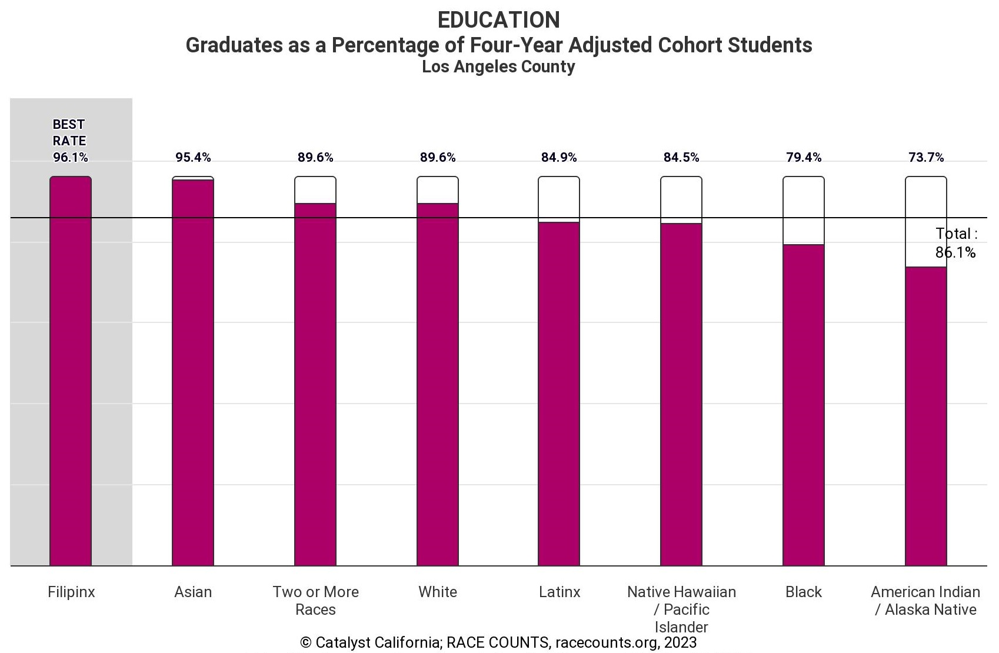

# RACE COUNTS
### January 2024

<base target="_blank">

  
Table of Contents

  <ol>
    <li>
      <a href="#about-the-project">About The Project</a></li>
    <li><a href="#about-the-data">About The Data</a></li>
     <ul>
        <li><a href="#indicators">Indicators</a></li>
        <li><a href="#indexes">Indexes</a></li>
        <li><a href="#data-methodology">Data Methodology</a></li>
        <li><a href="#measuring-outcomes,-impact-&-racial-disparity">Measuring Outcomes, Impact & Disparity</a></li>
        <li><a href="#summarizing-racial-disparity">Summarizing Racial Disparity</a></li>
        <li><a href="#key-limitations">Key Limitations</a></li>
      </ul>
    <li><a href="#contributors">Contributors</a></li>
    <li><a href="#contact-us">Contact Us</a></li>
    <li><a href="#citation">Citation</a></li>
    <li><a href="#license">License</a></li>
    <li><a href="#race-counts-partners">RACE COUNTS Partners</a></li>
  </ol>

## About The Project

The website [RACECOUNTS.org](https://www.racecounts.org?target=_blank) is one part of the larger RACE COUNTS initiative created by [Catalyst California](https://www.catalystcalifornia.org/) (formerly Advancement Project California) and partners. At Catalyst California, we strategize with community partners to identify funding, services and opportunities in our public systems that can be redistributed for more just outcomes for all. Our goal is to promote racial equity and build a foundation so that every Californian may thrive. The RACE COUNTS website includes an analysis of racial disparity, overall outcomes, and impact based on population size. This repo is meant to make the methods we use more transparent and duplicable. The repo is a work in progress and we will continue to add more documentation around indicators, indexes, and more as we continue to update the website.

(<a href="#top">back to top</a>)

# About The Data

## Indicators
RACE COUNTS includes 46 county/state indicators, and 28 city indicators, across seven issues. The issues include: Crime & Justice, Democracy, Economic Opportunity, Education, Health Care Access, Healthy Built Environment, and Housing. These issues and indicators were selected through a collaborative process with our partners. Find out more about our partners here: [https://www.racecounts.org/about/](https://www.racecounts.org/about/). For each indicator, counties and cities receive a rank for racial disparity and a rank for overall outcomes. The county or city ranked one for disparity is the most racially disparate, while a county or city ranked one for outcomes has the best outcomes. 

## Indexes
At county level only, we calculate one index for each of the seven issue indexes including all, or most, indicators in that issue. At city and county level, we calculate an overall Racial Equity Index combining all indicators. In all indexes, each county and city receives a rank for racial disparity and a rank for overall outcomes. The county or city ranked one for disparity is the most racially disparate, while a county ranked one for outcomes has the best outcomes.

## Data Methodology
[RACE COUNTS: Indicator Methodology for County and State](https://github.com/catalystcalifornia/RaceCounts/blob/main/Methodology/IndicatorMethodology_CountyState.pdf)  
[RACE COUNTS: Indicator Methodology for City](https://github.com/catalystcalifornia/RaceCounts/blob/main/Methodology/IndicatorMethodology_City.pdf)   
[RACE COUNTS: Race & Ethnicity Methodology)](https://github.com/catalystcalifornia/RaceCounts/blob/main/Methodology/README_Race_Ethnicity.md)  

<!--[RACE COUNTS: Key Takeaways Methodology (2023)](https://github.com/catalystcalifornia/RaceCounts/blob/main/KeyTakeaways/README_Key_Takeaways.md)  -->

## Measuring Outcomes, Impact & Racial Disparity
Measuring outcomes and impact are straightforward. An outcome is the rate for the total population on an indicator, across an issue, or across all issues. For example, when we compare outcomes in high school graduation rates between Los Angeles and Orange counties, we are comparing their overall graduation rates. Impact is the size of the total population. Following this example, Los Angeles has a population of nearly 10 million people, more than three times the size of Orange, with a population of nearly 3.1 million people. All else being equal, expected impacts of disparities are thus expected to be larger in Los Angeles than Orange county based on population size.

Racial disparity is more complicated. We calculate disparity in RACE COUNTS for two main reasons: to compare racial groups directly to one another (e.g., life expectancy of Latinx vs. Whites) and to summarize the overall level of disparity across all races for comparison across counties (e.g., disparity in high school graduation rates in Los Angeles County vs. Orange County). The overall disparity measure summarizes all of the individual racial group comparisons.

Racial groups are directly compared with a straightforward rate difference. To compare high school graduation rates of Latinx and Whites in a county would simply be subtracting the Latinx high school graduation rate from the White high school graduation rate, with a result of 0 implying total equity. In Figure 1, the rate difference between Latinx and Whites is 4.7% in Los Angeles County (89.6% – 84.9% = 4.7%).

## Summarizing Racial Disparity
We use a metric called the Index of Disparity (ID) to summarize overall equity in outcomes. The ID is the average of the absolute rate differences between each group rate and a reference rate. This average is expressed as a percentage of the reference rate (Pearcy and Keppel 2002, Harper et al. 2010, Harper 2011). For RACE COUNTS we use the best rate (best outcome) out of all racial groups as the reference rate for IDs to prioritize both equity and progress. Note: In rare cases where the best rate cannot be used because of data limitations, we have substituted the total population rate or the best non-zero rate. 

For example, consider Los Angeles County high school graduation. Los Angeles County schools graduate Filipinx students at the highest rate (96.1%), making this the reference rate. The ID or average difference in high school graduation rates of each race from the reference rate is 11.2%. This is more than double Orange County’s high school graduation ID of 4.6%.

The ID is sensitive to how we define an indicator (i.e., insured vs uninsured, employed vs unemployed). We make a call as the analyst “experts” on which is the best way to represent an indicator, based on how it is used in the literature, what we think is helpful for this project, and also, based on how the indicator is understood and used in general.

## Key Limitations
Our methodology has a number of limitations as does any data analysis, but three are worth highlighting here.

First, race is incredibly intersectional and RACE COUNTS primarily focuses on the racial experience. Intersectional experiences related to class, immigrant status, gender, and other population characteristics are largely absent from the outcome, disparity, and impact analysis. Thus, the results hide important findings by class, immigrant status and more.

Second, RACE COUNTS primarily includes data at city, county, and state levels. The county and state results can obscure important trends at sub-county levels.  

Finally, while RACE COUNTS is the most comprehensive compilation of data about racial equity by county in California, clear weaknesses in available data are evident. Data availability in the Democracy issue was particularly challenging for less populous places. The availability of data by race at sub-state levels was challenging across the board, and we created weighted averages to address this issue in some cases such as Lack of Greenspace.

(<a href="#top">back to top</a>)

## Contributors
* [Alexandra Baker, Research & Data Analyst II](https://github.com/bakeralexan)
* [Chris Ringewald, Senior Director of Research & Data Analysis](https://github.com/cringewald)
* [David Segovia, Research & Data Analyst I](https://github.com/davidseg1997)
* [Elycia Mulholland Graves, Director of Research & Data Analysis](https://github.com/elyciamg)
* [Hillary Khan, Database Architect Manager](https://github.com/hillarykhan)
* [Jennifer Zhang, Senior Research & Data Analyst](https://github.com/jzhang514)
* [Leila Forouzan, Senior Manager of Research & Data Analysis](https://github.com/lforouzan)
* [Maria Khan, Research & Data Analyst II](https://github.com/mariatkhan)

(<a href="#top">back to top</a>)

## Contact Us
[Chris Ringewald](https://www.linkedin.com/in/chris-ringewald-6766369/) - cringewald[at]catalystcalifornia.org   

[Leila Forouzan](https://www.linkedin.com/in/leilaforouzan/) - lforouzan[at]catalystcalifornia.org

## Citation
To cite RACE COUNTS, please use the following:

Catalyst California; RACE COUNTS, racecounts.org, [current year].

## License

[License](License.md)

(<a href="#top">back to top</a>)

## RACE COUNTS Partners

* [CALIFORNIA CALLS](https://www.cacalls.org/)
* [USC Dornsife](https://dornsife.usc.edu/)
* [PICO California](http://www.picocalifornia.org/)

(<a href="#top">back to top</a>)

