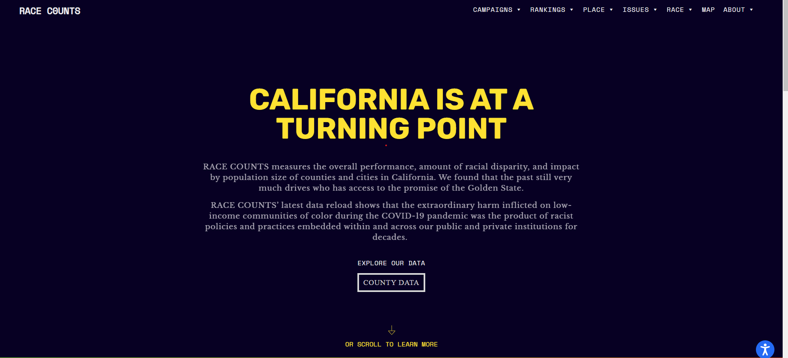

# RACE COUNTS
### Fall 2023

<base target="_blank">
<!-- NOTE: Need to replace homepage image, findings images
-->




<details>
  <summary>Table of Contents</summary>
  <ol>
    <li>
      <a href="#about-the-project">About The Project</a></li>
    <li><a href="#getting-started">Getting Started</a>
      <ul>
        <li><a href="#prerequisites">Prerequisites</a></li>
        <li><a href="#installation">Installation</a></li>
      </ul>
    </li>
    <li><a href="#generate-key-findings">Generate Key Findings</a></li>
    <li><a href="#draft-findings-and-visuals">Draft Findings and Visuals</a></li>
    <li><a href="#data-methodology">Data Methodology</a></li>
    <li><a href="#contributors">Contributors</a></li>
    <li><a href="#contact-us">Contact Us</a></li>
    <li><a href="#github-link">Github Link</a></li>
    <li><a href="#citation">Citation</a></li>
    <li><a href="#license">License</a></li>
    <li><a href="#race-counts-partners">RACE COUNTS Partners</a></li>
  </ol>
</details>


## About The Project

The website [RACECOUNTS.org](https://www.racecounts.org?target=_blank) is one part of the larger RACE COUNTS initiative created by [Catalyst California](https://www.catalystcalifornia.org/) (formerly Advancement Project California) and partners. At Catalyst California, we strategize with community partners to identify funding, services and opportunities in our public systems that can be redistributed for more just outcomes for all. Our goal is to promote racial equity and build a foundation so that every Californian may thrive. The RACE COUNTS website includes an analysis of racial disparity, overall outcomes, and impact based on population size. This repo is meant to make the methods we use more transparent and duplicable. The repo is a work in progress and we will continue to add more documentation around indicators, indexes, and more as we continue to update the website.

Note: The code does not include lines relating to importing of the data. We pull tables from our private PostgreSQL database using credentials accessed through a separate script before running any of the code below. The database is accessible only by our Research & Data Analysis team. However, we do plan to share a public file with the complete data for each RACE COUNTS indicator, where possible, here soon.


<p align="right">(<a href="#top">back to top</a>)</p>


## Getting Started

To get a local copy up and running follow these simple steps. 

### Prerequisites

We completed the data cleaning, analysis, and visualization using the following software. 
* [R](https://cran.rstudio.com/)
* [RStudio](https://posit.co/download/rstudio-desktop)

We used several R packages to analyze data and perform different functions, including the following.
* data.table 
* dplyr
* sf
* tidyr
* usethis

```
list.of.packages <- c("usethis","dplyr","data.table", "sf", tidyr")
new.packages <- list.of.packages[!(list.of.packages %in% installed.packages()[,"Package"])]
if(length(new.packages)) install.packages(new.packages)

devtools::install_github("r-lib/usethis")

library(usethis)
library(dplyr)
library(data.table)
library(sf)
library(tidyr)
```

### Installation

<!-- 1. Get a free TidyCensus API Key at [https://walker-data.com/tidycensus/articles/basic-usage.html](https://walker-data.com/tidycensus/articles/basic-usage.html)-->

Clone the repo
   ```sh
   git clone https://github.com/github_username/repo_name.git
   ```


<p align="right">(<a href="#top">back to top</a>)</p>


## Generate Key Findings

<!-- Will need to update to say key_findings_2023.R-->
**This section is an explanation of the key_findings_2022.R script.**

### Data Loading and Set Up
Import the cleaned and standardized data for each indicator from our private database into RStudio, then combine into one massive dataframe (df).
<details>
<summary>Code Explanation</summary>

Join issue area dataframes together into one final dataframe. This process is time-consuming because of the amount of data pulled in from the database and the amount of reformatting done. So once you have this large dataframe, it's a good idea to work with a copy of it. That way, you will not have to re-import and clean the data again if you need to change the code that comes after these steps. As mentioned above, we plan to make a file with complete clean indicator data, where possible, available here soon. 


```
# Combine all cleaned issue area dataframes into one final df ----------------------------------

df <- bind_rows(crime, democracy, economic, education, hbe, health, housing)
```

Create short form to long form race and indicator label crosswalks that will be used to generate key findings.

```
# Create race name crosswalk ------------------------------------------------
race_generic <- unique(df$race_generic)
long_name <- c("Total", "API", "Black", "Latinx", "American Indian / Alaska Native", "White", "Asian", "Two or More Races", "Native Hawaiian / Pacific Islander", "Other Race", "Filipinx")
race_names <- data.frame(race_generic, long_name)

# Create indicator name crosswalk -------------------------------------------

indicator <- c("Employment","Living Wage","Per Capita Income","Cost-of-Living Adjusted Poverty","Overcrowded Housing","Connected Youth","Officials and Managers",
               "Internet Access","Life Expectancy","Health Insurance","Preventable Hospitalizations","Low Birthweight","Usual Source of Care","Got Help",
               "High School Graduation","3rd Grade English Proficiency","3rd Grade Math Proficiency","Suspensions","Early Childhood Education Access",
               "Teacher & Staff Diversity","Chronic Absenteeism","Subprime Mortgages","Housing Quality","Renter Cost Burden","Homeowner Cost Burden","Foreclosures",
               "Denied Mortgages","Homeownership","Student Homelessness","Evictions","Diversity of Electeds","Diversity of Candidates","Voting in Presidential Elections",
               "Voting in Midterm Elections","Voter Registration","Census Participation","Arrests for Status Offenses","Use of Force","Incarceration","Perception of Safety",
               "Drinking Water Contaminants","Food Access","Proximity to Hazards","Toxic Releases from Facilities","Asthma","Lack of Greenspace")             


indicator_short <- c("employ","livwage","percap","realcost","overcrowded","connected","officials","internet","life","insur","hosp","bwt","usoc","help","grad","ela","math",     
                     "susp","ece","diver","abst","subprime","quality","burden_rent","burden_own","forecl","denied","homeown","homeless","eviction","elected","candidate",
                     "president","midterm","voter","census","offenses","force","incarceration","safety","water","food","hazard","toxic","asthma","green")

indicator <- data.frame(indicator, indicator_short)
```
</details>

### Count of Worst/Best Rate Findings

Create findings identifying the number of times each race has the worst and best rates in each geography. These findings are found on Race pages.

<details>
<summary>Code Explanation</summary>

* Step 1: Remove total (overall) rates because we are developing key findings by race. Reclassify combined Asian-Pacific Islander (API) data.
```
df_lf <- filter(df, race != 'total')
```

Not all data sources report Asian and Pacific Islander data separately. Duplicate the rows that contain combined Asian-Pacific Islander (API) data, then relabel one set of the duplicated rows as Asian, and the other as Native Hawaiian / Pacific Islander. Delete the original API rows, and bind the newly created Asian and Native Hawaiian / Pacific Islander rows back to the main dataframe.
```
# duplicate API rows, assigning one set race_generic Asian and the other set PacIsl
  api_asian <- filter(df_lf, race_generic == 'api') %>% mutate(race_generic = 'asian')
  api_pacisl <- filter(df_lf, race_generic == 'api') %>% mutate(race_generic = 'pacisl')
  df_lf <- filter(df_lf, race_generic != 'api')       # remove api rows
  df_lf <- bind_rows(df_lf, api_asian, api_pacisl)    # add back api rows as asian AND pacisl rows
```

* Step 2: Count the number of non-null rates for each race and geography combo to screen key findings later.

```
bestworst_screen <- df_lf %>% group_by(geoid, race_generic) %>% summarise(rate_count = sum(!is.na(rate)))  # count number of non-null rates for each race+geo combo
                      
```

* Step 3: Count number of times each race has the worst rate (highest disparity z-score) for each geography. Screen out observations where fewer than 2 races in a geography have non-null values for an indicator. 
```

filter_nonRC <- df_lf %>% filter(values_count == "2" & !is.na(rate)) %>%
                select(geoid, geoname, issue, indicator) %>% mutate(remove = 1) # create df of observations with two or more groups having non-null values

worst_table  <- df_lf %>% left_join(filter_nonRC) %>%   
                filter(is.na(remove) & values_count > 1) %>%  
                group_by(geoid, indicator) %>% top_n(1, disparity_z_score) %>% # get worst rate, excluding total rate, by geo+indicator
                rename(worst_rate = race_generic) %>% select(-remove)
                
```                

Create final df used for Worst Count key finding, drop indicators where only one group has a non-null rate.

```

worst_table2 <- subset(df_lf, values_count > 1) %>%  
                left_join(select(worst_table, geoid, indicator, worst_rate), by = c("geoid", "indicator")) %>%
                mutate(worst = ifelse((race_generic == worst_rate), 1, 0)) %>%         # identify which race has the worst rate for each geo    
                group_by(geoid, geoname, race_generic) %>% summarise(count = sum(worst, na.rm = TRUE)) %>%   # count the number of times each race has worst rate in each geo
                left_join(race_names, by = "race_generic") %>%          # pull in long race labels for key findings                              
                left_join(bestworst_screen, by = c("geoid", "race_generic")) 
worst_table2 <- worst_table2 %>% mutate(count = ifelse(is.na(count) & rate_count > 0, 0, count)) 

```

Create the "shells" used to create the key finding sentences. Input the variables created above to create key findings.

``` 
# Generate key finding for RACECOUNTS.org  Race pages
worst_rate_count <- filter(worst_table2, !is.na(rate_count)) %>% mutate(geoname = gsub(' County', '', geoname), finding_type = 'worst count', findings_pos = 2) %>% 
                    mutate(finding = ifelse(rate_count > 5, paste0(geoname, "'s ", long_name, " residents have the worst rate for ", count, " of the ", rate_count, " RACE COUNTS indicators with data for them."), paste0("Data for ", long_name, " residents of ", geoname, " is too limited for this analysis.")))

```

* Step 4: Apply same steps to generate Best Rate key findings. Note: This code differs from Worst Rate code to account for when the lowest rate is best and one or more raced rates are 0.
  
```
  best_table <- subset(df_lf, values_count > 1 & !is.na(rate)) %>%  # drop indicators with only 1 non-null raced rate              
                select(c(geoid, issue, indicator, values_count, geolevel, asbest, rate, race_generic)) %>% 
                group_by(geoid, issue, indicator, values_count, geolevel, asbest) %>% 
                mutate(best_rank = ifelse(asbest == 'min', dense_rank(rate), dense_rank(-rate)))  %>% # use dense_rank to give ties the same rank, and all integer ranks
                mutate(best_rate = ifelse(best_rank == 1, race_generic, ""))    # identify race with best rate using best_rank
  best_table <- best_table %>% left_join(filter_nonRC) %>% filter(is.na(remove)) %>% select(-geoname, -remove) 
  
  
  best_table2 <- subset(df_lf, values_count > 1) %>%  # drop indicators with only 1 non-null raced rate 
                 left_join(select(best_table, geoid, indicator, best_rate), by = c("geoid", "indicator")) %>%
                 mutate(best = ifelse((race_generic == best_rate), 1, 0)) %>%                              # identify which race has best rate in each geo
                 group_by(geoid, geoname, race_generic) %>% summarise(count = sum(best, na.rm = TRUE)) %>% # count the number of times each race has best rate in each geo
                 left_join(race_names, by = c("race_generic")) %>%
                 left_join(bestworst_screen, by = c("geoid", "race_generic"))
  best_table2 <- best_table2 %>% mutate(count = ifelse(is.na(count) & rate_count > 0, 0, count))
  
    
  best_rate_count <- filter(best_table2, !is.na(rate_count)) %>% mutate(geoname = gsub(' County', '', geoname), finding_type = 'best count', findings_pos = 1) %>%
              mutate(finding = ifelse(rate_count > 5, paste0(geoname, "'s ", long_name, " residents have the best rate for ", count, " of the ", rate_count, " RACE COUNTS indicators with data for them."), paste0("Data for ", long_name, " residents of ", geoname, " is too limited for this analysis."))) 
              
```

Step 5: Bind the Worst and Best Rate findings, drop findings for groups that do not have Race pages on RACECOUNTS.org.
<!-- Insert reference to Race & Ethnicity Methodology doc once it's created. -->

```
worst_best_counts <- bind_rows(worst_rate_count, best_rate_count)
worst_best_counts <- rename(worst_best_counts, geo_name = geoname, race = race_generic) %>% select(-long_name, -rate_count, -count)
worst_best_counts <- worst_best_counts %>% mutate(geo_level = ifelse(geo_name == 'California', 'state', 'county')) %>% filter(!race %in% c('filipino', 'other', 'twoormor')) # filter out races that don't have RC Race Pages
  
```

</details>


### Most Impacted Finding

Create findings identifying the race most impacted by racial disparity in each geography using counts from the Worst Rate Findings. The most impacted race in a geography is the group that has the highest count of worst rates. These findings are found on Place pages.

<details>
<summary>Code Explanation</summary>
This finding is generated with the following steps:

  
* Step 1: Create a screen to be applied later. Create a table counting number of indicators with overall disparity z-scores (requires two or more groups with non-null rates) per geography.

```
  impact_screen <- df_lf %>% group_by(geoid, geoname, indicator) %>% summarise(count = sum(!is.na(disparity_z_score)))
  impact_screen <- filter(impact_screen, count > 1) %>% group_by(geoid, geoname) %>% summarise(id_count = n())    
```

* Step 2: Pull in final dataframe from Worst Rate findings: <i>worst_table2</i>. Generate key findings identifying which race(s) faces the most racial disparity in each geography. Suppress findings for counties with too few Indexes of Disparity for a substantial analysis.
  
```
  impact_table <- worst_table2 %>% select(-rate_count) %>% group_by(geoid, geoname) %>% top_n(1, count) %>%    # get race most impacted by racial disparity by geo
  left_join(select(impact_screen, geoid, id_count), by = "geoid")
  # Some counties may have ties for group with the most worst rates

  ## the next few lines concatenate the names of the tied groups to prep for key findings
  impact_table2 <- impact_table %>% 
    group_by(geoid, geoname, count) %>% 
    mutate(long_name2 = paste0(long_name, collapse = " and ")) %>% select(-c(long_name, race_generic)) %>% unique()
  most_impacted <- impact_table2 %>% mutate(finding = ifelse(id_count > 4, paste0("Across indicators, ", geoname, " ", long_name2, " residents are most impacted by racial disparity."), paste0("Data for residents of ", geoname, " is too limited for this analysis.")))
  
```
 
</details>


### Most Disparate Indicator by Race & Place

Create findings identifying the indicator with the most racial disparity (highest disparity z-score) for each race in each geography. These findings are found on Race pages.

<details>

<summary>Code Explanation</summary>

* Create one long function to generate Most Disparate by Race & Place findings. Below we break down the custom function "most_disp_by_race" into three steps.

```
# Function to prep raced most_disparate tables
  most_disp_by_race <- function(x, y, d) {
  
```
* Step 1: Create a function that pulls the column with the maximum value. 
```
    # Nested function to pull the column with the maximum value ----------------------
    find_first_max_index_na <- function(row) {
      
      head(which(row== max(row, na.rm=TRUE)), 1)[1]
    }
```
* Step 2: This first half of the function applies only to American Indian / Alaska Native, Black, Latinx, and White data. First we reformat the data from 'wide' to 'long' format. Then count the number of indicators with data and identify the indicator with the highest disparity z-score for each race in each geography. Finally, we generate a key finding based on the most disparate indicator by race for each geography.  
```
    if(is.null(d)) {       ## For races excluding Asian and NatHaw / PacIsl
      # filter by race, pivot_wider, select the columns we want, get race long_name
      z <- x %>% filter(race_generic == y) %>% pivot_wider(names_from = indicator, values_from = disparity_z_score) %>% group_by(geoid, geoname) %>% 
        fill(incarceration:subprime, .direction = 'updown') %>% 
        filter (!duplicated(geoname)) %>% select(-race) %>% rename(race = race_generic) %>% select(geoid, geoname, race, incarceration:subprime)
      z <- z %>% inner_join(race_names, by = c('race' = 'race_generic')) %>% select(geoid, geoname, race, long_name, everything()) 
      
      # count indicators
      indicator_count <- z %>% ungroup %>% select(-geoid:-long_name)
      indicator_count$indicator_count <- rowSums(!is.na(indicator_count))
      z$indicator_count <- indicator_count$indicator_count 
      
      # select columns we need
      z <- z %>% select(geoid, geoname, race, long_name, indicator_count, everything())
      
      # unique indicators that apply to race
      indicator_col <- z %>% ungroup %>% select(6:ncol(z))
      indicator_col <- names(indicator_col)
      
      # pull the column name with the maximum value
      z$max_col <- colnames(z[indicator_col]) [
        apply(
          z[indicator_col],
          MARGIN = 1,
          find_first_max_index_na )
      ]
      
      ## merge with indicator
      z <- left_join(z, indicator, by = c("max_col"="indicator_short"))
      
      ## add finding
      z <- z %>% mutate(
        finding = ifelse(indicator_count <= 5,     ## Suppress finding if race+geo combo has 5 or fewer indicator overall disparity_z scores
                         paste0("Data for ", long_name, " residents of ", geoname, " is too limited for this analysis."),
                         paste0(indicator, " is the most disparate indicator for ", long_name, " residents of ", geoname, "."))
      ) %>% select(
        geoid, geoname, race, long_name, indicator_count, finding) %>% arrange(geoname)
      
      return(z)
    }
```
* Step 3: Use a similar but slightly different process as Step 2. This chunk applies only to Asian and Native Hawaiian / Pacific Islander data because not all data sources report Asian and Pacific Islander data separately. Combine Asian and Asian-Pacific Islander data into Asian, combine Native Hawaiian / Pacific Islander and Asian-Pacific Islander data into Native Hawaiian / Pacific Islander.  

```
    else {       ## For Asian and PacIsl only bc we count Asian+API and NatHaw/PacIsl+API
      # filter by race, pivot_wider, select the columns we want, get race long_name
      z <- x %>% filter(race_generic == y | race_generic == d) %>% pivot_wider(names_from = indicator, values_from = disparity_z_score) %>% group_by(geoid, geoname) %>% 
        fill(incarceration:subprime, .direction = 'updown') %>% 
        filter (!duplicated(geoname)) %>% select(-race_generic) %>% mutate(race = y) %>% select(geoid, geoname, race, incarceration:subprime)
      z <- z %>% inner_join(race_names, by = c('race' = 'race_generic')) %>% select(geoid, geoname, race, long_name, everything()) 
      
      indicator_count <- z %>% ungroup %>% select(-geoid:-long_name)
      indicator_count$indicator_count <- rowSums(!is.na(indicator_count))
      z$indicator_count <- indicator_count$indicator_count 
      
      # select columns we need
      z <- z %>% select(geoid, geoname, race, long_name, indicator_count, everything())
      
      # unique indicators that apply to race
      indicator_col <- z %>% ungroup %>% select(7:ncol(z))
      indicator_col <- names(indicator_col)
      
      # pull the column name with the maximum value
      z$max_col <- colnames(z[indicator_col]) [
        apply(
          z[indicator_col],
          MARGIN = 1,
          find_first_max_index_na )
      ]
      
      ## merge with indicator
      z <- left_join(z, indicator, by = c("max_col"="indicator_short"))
      
      ## add finding
      z <- z %>% mutate(
        finding = ifelse(indicator_count<=5, ## threshold of equal to or less than 5
                         paste0("Data for ", long_name, " residents of ", geoname, " is too limited for this analysis."),
                         paste0(indicator, " is the most disparate indicator for ", long_name, " residents of ", geoname, "."))
      ) %>% select(
        geoid, geoname, race, long_name, indicator_count, finding) %>% arrange(geoname)
      
      return(z)
    }
  }
```
* Step 4: Apply the function to subsets of the dataframe filtered for Asian (and API), Native Hawaiian / Pacific Islander (and API), American Indian / Alaska Native, Black, Latinx, and White data.
```
  # copy df before running any code
  df_ds <- filter(df, race != 'total')    # remove total rates bc all findings in this section are raced
  
  # apply function to generate most disparate by race findings
  aian_ <- most_disp_by_race(df_ds, 'aian', d = NULL)
  asian_ <- most_disp_by_race(df_ds, 'asian', 'api')
  black_ <- most_disp_by_race(df_ds, 'black', d = NULL)
  latinx_ <- most_disp_by_race(df_ds, 'latino', d = NULL)
  pacisl_ <- most_disp_by_race(df_ds, 'pacisl', 'api')
  white_ <- most_disp_by_race(df_ds, 'white', d = NULL)
``` 
* Step 5: Combine all the findings into one final dataframe. 
```
  final_findings <- bind_rows(aian_, asian_, black_, latinx_, pacisl_, white_) 
  final_findings <- rename(final_findings, geo_name = geoname) %>% select(-indicator_count, -long_name)
  most_disp <- final_findings %>% mutate(geo_level = ifelse(geo_name == 'California', 'state', 'county'),
                                         finding_type = 'most disparate',
                                         findings_pos = 3, geo_name = gsub(' County', '', geo_name))
 

```

</details>


### Lowest Outcome Indicator by Place

Create findings identifying the indicator with the worst outcomes (lowest overall outcome z-score) in each geography. These findings are found on Place pages.

<details>

<summary>Code Explanation</summary>

The code below pulls tables from our private PostgreSQL database using credentials accessed through a separate script. This database is accessible only by our Research & Data Analysis team. However, we do plan to share a public file with the complete data for each RACE COUNTS indicator, where possible, here soon.

* Step 1: Put dataframes containing issue area index data imported from private database into a list.

```

data_list <- list(c_1, c_2, c_3, c_4, c_5, c_6, c_7)

```

* Step 2: Select just the necessary columns including the county name and overall outcome z-scores. Then merge into one matrix, removing duplicated county_id columns. Convert new matrix from 'wide' to 'long' format.

```

# Keep only perf_z column
select_cols <- lapply(data_list, select, "county_name", ends_with(c("perf_z")))
merged_perf <- reduce(select_cols, inner_join, by = "county_name")
perf_long <- melt(merged_perf, id.vars=c("county_name"))

```

* Step 3: Rank indicators with worst outcomes (lowest outcome z-score) equal to a rank of 1. Select the indicator with the worst outcome in each geography. Rename variable and value fields.

```

perf_final <- perf_long %>%
  group_by(county_name) %>%
  mutate(rk = min_rank(-value))
  
perf_final <- perf_final %>% filter(rk == 1) %>%
  arrange(county_name) 
  
names(perf_final)[names(perf_final) == 'value'] <- 'worst_perf_z'
names(perf_final)[names(perf_final) == 'variable'] <- 'worst_perf_indicator'

```

* Step 4: Clean variable names, then join with indicator name crosswalk to get long indicator names for findings.

```

perf_final$worst_perf_indicator <- gsub('_perf_z', '', perf_final$worst_perf_indicator)

worst_perf <- select(perf_final, -c(rk, worst_perf_z)) %>%   # drop rank and z-score fields, join to indicator name equivalency table
  left_join(indicator, by = c("worst_perf_indicator" = "indicator_short")) %>% rename(long_perf_indicator = indicator)

```

* Step 5: Make adjustments for geographies with two or more indicators tied for Worst Outcome.

```

worst_perf2 <- worst_perf %>% 
  group_by(county_name) %>% 
  mutate(perf_ties = n()) %>%
  mutate(long_perf_indicator = paste0(long_perf_indicator, collapse = " and ")) %>% select(-c(worst_perf_indicator)) %>% unique()

```

* Step 6: Generate Worst Outcome key findings.

```

worst_perf2 <- worst_perf2 %>% 
  mutate(Lowest_Performing_Indicator = ifelse(perf_ties > 1, 
                                      paste0(county_name, " County's low overall outcomes in ", long_perf_indicator," stand out most compared to other counties."),
                                      paste0(county_name, " County's low overall outcome in ", long_perf_indicator," stands out most compared to other counties."))) %>% 
  select(county_name, Lowest_Performing_Indicator)

```


</details>


### Highest Disparity Indicator by Place

Create key findings identifying the indicator with the largest racial disparities in each geography. These findings are found on Place pages.

<details>

<summary>Code Explanation</summary>

The code below pulls tables from our private PostgreSQL database using credentials accessed through a separate script. This database is accessible only by our Research & Data Analysis team. However, we do plan to share a public file with the complete data for each RACE COUNTS indicator, where possible, here soon.

* Step 1: Put dataframes containing issue area index data imported from private database into a list.

```

data_list <- list(c_1, c_2, c_3, c_4, c_5, c_6, c_7)

```

* Step 2: Select just the necessary columns including the county name and overall disparity z-scores. Then merge into one matrix, removing duplicate county_id columns. Convert new matrix from 'wide' to 'long' format.

```

# Keep only disp_z column
select_cols <- lapply(data_list, select, 
                      "county_name",
                      ends_with(c("disp_z")))
merged_disp <- reduce(select_cols, inner_join, by = "county_name")
disp_long <- melt(merged_disp, id.vars=c("county_name"))

```

* Step 3: Rank indicators with most disparity (highest overall disparity z-score) equal to a rank of 1. Select the indicator with the worst disparity in each geography. Rename variable and value fields.

```

disp_final <- disp_long %>%
  group_by(county_name) %>%
  mutate(rk = min_rank(-value))
  
disp_final <- disp_final %>% filter(rk == 1) %>%
  arrange(county_name) 

names(disp_final)[names(disp_final) == 'value'] <- 'worst_disp_z'
names(disp_final)[names(disp_final) == 'variable'] <- 'worst_disp_indicator'    

```

* Step 4: Clean variable names, then join with indicator name crosswalk to get long indicator names for findings.

```

disp_final$worst_disp_indicator <- gsub('_disp_z', '', disp_final$worst_disp_indicator)

worst_disp <- select(disp_final, -c(rk, worst_disp_z)) %>%   # drop rank and z-score fields, join to indicator name equivalency table
  left_join(indicator, by = c("worst_disp_indicator" = "indicator_short")) %>% rename(long_disp_indicator = indicator)

```

* Step 5: Make adjustments for geographies with two or more indicators tied for worst disparity.

```

worst_disp2 <- worst_disp %>% 
  group_by(county_name) %>% 
  mutate(disp_ties = n()) %>%
  mutate(long_disp_indicator = paste0(long_disp_indicator, collapse = " and ")) %>% select(-c(worst_disp_indicator)) %>% unique()

```

* Step 6: Generate Highest Disparity key findings.

```

worst_disp2 <- worst_disp2 %>% 
  mutate(Most_Disp_Indicator = ifelse(disp_ties > 1, 
                                      paste0(county_name, " County's high racial disparity in ", long_disp_indicator," stand out most compared to other counties."),
                                      paste0(county_name, " County's high racial disparity in ", long_disp_indicator," stands out most compared to other counties."))) %>% 
  select(county_name, Most_Disp_Indicator)

```

</details>


### Above or Below Average Racial Disparity and Outcomes by Place

Create key findings identifying whether a geography has above or below average disparity and outcomes as compared to other geographies of the same type. These findings are based on the average disparity z-score and average outcome z-score across all indicators for each geography. When the average disparity or outcome z-score across all indicators is below zero, we say that the disparity is or outcomes are below average. If the average disparity or outcome z-score is above zero, we say that the disparity is or outcomes are above above average. These findings are found on Place pages.

<details>

<summary>Code Explanation</summary>
The code below pulls tables from our private PostgreSQL database using credentials accessed through a separate script. This database is accessible only by our Research & Data Analysis team. However, we do plan to share a public file with the complete data for each RACE COUNTS indicator, where possible, here soon.

* Step 1: After importing dataframe containing composite index data imported from private database, select only needed fields. Then reclassify outcome and disparity z-scores as above or below average.

```

sum_statement_df <- c_1 %>% 
  select(county_id, county_name, urban_type, disparity_z, performance_z) %>%
  mutate(perf_type = ifelse(performance_z < 0, 'below', 'above'),
         disp_type = ifelse(disparity_z < 0, 'below', 'above'))

```

* Step 2: Generate Above and Below Average key findings for disparity and outcomes.

```
sum_statement_df <- sum_statement_df  %>% 
  mutate(Perf_Level_Statement = ifelse(is.na(perf_type), NA, paste0(county_name, " County's outcomes across indicators are ", perf_type, " average for California counties.")),
                      Disp_Level_Statement = ifelse(is.na(disp_type), NA, paste0(county_name, " County's racial disparity across indicators is ", disp_type, " average for California counties."))) %>% 
  select(county_name, Perf_Level_Statement, Disp_Level_Statement) 

sum_statement_df <- sum_statement_df[order(sum_statement_df$county_name),]

```

</details>


<p align="right">(<a href="#top">back to top</a>)</p>


## Data Methodology

[RACE COUNTS: Indicator Methodology for County and State (2023)](https://github.com/catalystcalifornia/RaceCounts/blob/main/Methodology/IndicatorMethodology_CountyState.pdf) <br>
<!-- [RACE COUNTS: Indicator Methodology for City (2023)](https://github.com/catalystcalifornia/RaceCounts/blob/main/Methodology/IndicatorMethodology_City.pdf) <br> -->
 
## Contributors

* [Alexandra Baker, Research & Data Analyst I](https://github.com/bakeralexan)
* [Chris Ringewald, Senior Director of Research & Data Analysis](https://github.com/cringewald)
* [David Segovia, Research & Data Analyst I](https://github.com/davidseg1997)
* [Elycia Graves, Associate Director of Research & Data Analysis](https://github.com/elyciamg)
* [Hillary Khan, Database Architect](https://github.com/hillarykhan)
* [Jennifer Zhang, Senior Research & Data Analyst](https://github.com/jzhang514)
* [Leila Forouzan, Senior Manager of Research & Data Analysis](https://github.com/lforouzan)
* [Maria Khan, Research & Data Analyst II](https://github.com/mariatkhan)


<p align="right">(<a href="#top">back to top</a>)</p>


## Contact Us

[Chris Ringewald](https://www.linkedin.com/in/chris-ringewald-6766369/) - cringewald[at]catalystcalifornia.org  <br>


[Leila Forouzan](https://www.linkedin.com/in/leilaforouzan/) - lforouzan[at]catalystcalifornia.org

## Github Link

[Click here to view the RACE COUNTS Github Repo](https://github.com/advancementprojectca-rda/RaceCounts)

<p align="right">(<a href="#top">back to top</a>)</p>


## Citation
To cite RACE COUNTS, please use the following:

Catalyst California; RACE COUNTS, racecounts.org, 2022.


## License

[License](License.md)

<p align="right">(<a href="#top">back to top</a>)</p>


## RACE COUNTS Partners

* [CALIFORNIA CALLS](https://www.cacalls.org/)
* [USC Dornsife](https://dornsife.usc.edu/)
* [PICO California](http://www.picocalifornia.org/)

<p align="right">(<a href="#top">back to top</a>)</p>

